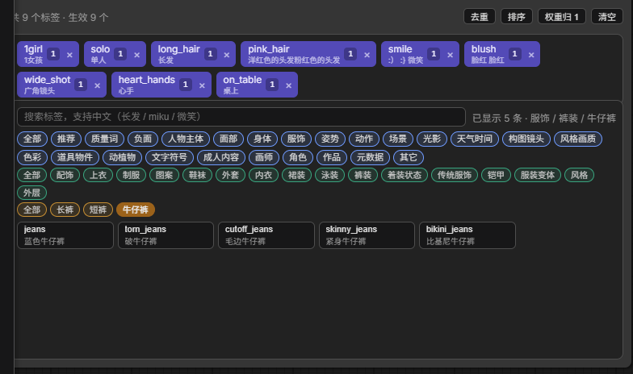

# 🏷️ ComfyUI-TagPromptEditor

给 ComfyUI 补上 **Stable Diffusion WebUI 的标签块（tag 方块）编辑体验**。

ComfyUI 原生写提示词只有一个 `CLIPTextEncode` 的多行文本框：纯文本、全英文，
改权重靠手打括号、删一个词要从一串逗号里找、排序靠剪切粘贴。
这个节点把那套交互补回来 —— 每个标签是一个可点、可拖、可调权重的方块，
下面还有一个带中文说明的全量 Danbooru 标签选择器。

节点输出 `STRING`，**直接接原生 `CLIPTextEncode` 的 text 输入**。
不替换、不劫持任何官方节点，卸载后旧工作流照常能跑（只是回到纯文本框）。



> 本文档对应 **v1.2.3**。历史版本见 [Tags](https://github.com/yuukisnow1208/ComfyUI-TagPromptEditor/tags)。

---

## 目录

- [安装](#安装)
- [快速上手](#快速上手)
- [界面与操作](#界面与操作)
- [提示词语法](#提示词语法)
- [常见问题](#常见问题)
- [已知限制](#已知限制)
- [数据来源与分类准确度](#数据来源与分类准确度)
- [HTTP 接口](#http-接口)
- [开发与测试](#开发与测试)
- [许可](#许可)

---

## 安装

### 要求

| 项 | 说明 |
| --- | --- |
| ComfyUI | 能在 `custom_nodes` 里装插件即可（开发环境为 ComfyUI 0.37.0 + 前端 1.53.6） |
| Python | 3.9+，**无需 `pip install` 任何东西**（只用标准库；`aiohttp` 是 ComfyUI 自带的） |
| 显卡 | 不需要。编辑器本身与显存无关 |

### 步骤

```bash
cd ComfyUI/custom_nodes
git clone https://github.com/yuukisnow1208/ComfyUI-TagPromptEditor.git
```

没有 git，就把仓库打包下载、解压到 `ComfyUI/custom_nodes/` 也一样。

> ⚠️ 目录必须是 `custom_nodes/ComfyUI-TagPromptEditor/` 这一层。
> **不支持**放进二级子目录（如 `custom_nodes/my-plugins/xxx`），ComfyUI 不会加载。

然后**重启 ComfyUI**。节点在右键菜单的 `utils/prompt` 分类下，
搜索框里输入「标签」「tag editor」「prompt editor」「webui」都能找到它。

> 尚未提交到 ComfyUI-Manager 的插件注册表，所以 Manager 里暂时搜不到，请用上面的方式安装。

### 词库

插件**自带**词库，不需要额外准备：

```
tags/danbooru.csv            3.19 MB   （GB18030 编码）
tags/danbooru.zh_CN_SFW.csv  3.14 MB   （UTF-8 编码）
```

如果你不想让仓库带着这 6 MB CSV，可以删掉 `tags/` —— 插件会去本机已装的
SD WebUI / Forge 里找 `extensions/a1111-sd-webui-tagcomplete/tags/`
（会扫 `C:`~`G:/AI/*/` 等常见位置）。也可以用环境变量手动指定：

```bash
TAG_PROMPT_EDITOR_TAGS_DIR=/path/to/your/tags
```

查找优先级：**环境变量 → 插件自带 `tags/` → 本机 SD WebUI 目录**。
三个都没有时编辑器仍能打开，但标签选择器会是空的，`/tag_prompt_editor/health`
的 `error` 字段会说明原因。

---

## 快速上手

1. 新建节点：`utils/prompt` → **🏷️ 标签提示词编辑器**。
2. 在**最下面的搜索框**输入中文或英文（试试「长发」或 `long_hair`），点结果卡片加入。
3. 上面的标签块区会出现方块 —— 鼠标移上去有工具条，拖动可排序，点 `×` 删。

节点内部从上到下是三块：

```
┌─────────────────────────────────────────────┐
│ 1girl, long_hair, (masterpiece:1.2), smile  │  ← ① 原生文本框（ComfyUI 自带）
├─────────────────────────────────────────────┤
│ 去重 排序 权重归1 清空  共7个 · 生效7个      │  ← ② 工具栏
│ [1girl] [long_hair] [masterpiece 1.2]       │  ←    标签块（英文）
│  1女孩    长发        杰作                  │     有中文 → 中文在下一行
├─────────────────────────────────────────────┤
│ 🔍 搜索……                   已显示 120+ 条  │  ← ③ 分类栏
│ [全部][推荐][质量词][负面][人物主体][面部]… │     第一行：24 个大类
│ [全部][配饰][上衣][制服][鞋袜][裤装]…       │     第二行：小类
│ [全部][长裤][短裤][牛仔裤]                  │     第三行：细类
│ ┌────────┐┌────────┐┌────────┐              │
│ │ jeans  ││ pants  ││shorts  │              │  ←    结果网格，滚到底自动翻页
│ │ 牛仔裤  ││ 长裤    ││ 短裤    │           │
└─────────────────────────────────────────────┘
```

编辑结果会实时写回 ① 的文本框 —— 所以保存、复制粘贴、撤销重做
全部复用 ComfyUI 原生机制，你不需要学任何新东西。

---

## 界面与操作

### 标签块区

| 操作 | 怎么做 |
| --- | --- |
| **编辑标签名** | **单击**方块里的文字 → 原地输入（回车保存 / Esc 取消） |
| **启用 / 禁用** | **双击**方块，或点工具条的 `⊘`。禁用后不参与输出，但方块保留 |
| **删除** | 点方块右侧的 `×`，或工具条的 `×` |
| **排序** | 按住方块拖拽，落点有插入指示线 |
| **批量** | 工具栏：`去重` / `排序`（字母序） / `权重归 1` / `清空` |

单击与双击靠 **250 ms 判定窗口**区分：单击后先等一下，确认没有第二下才进入编辑
（和 WebUI 的手感一致）。

**中文译名**：词库里有中文的标签，中文会显示在英文**下一行**，同一个方块里：

```
┌───────────────┐   ┌───────────────┐
│ 1girl      1 ×│   │ best_quality 1×│
│ 1女孩          │   └───────────────┘
└───────────────┘    词库里没中文 → 保持单行
```

中文是**按需异步补的**：方块先把英文画出来，再把这一批里还没查过的名字一次性
问后端，结果缓存在浏览器里（同一个标签只问一次，点选、拖拽、重排都不会重复请求）。
所以刚打开工作流的那一下能看到中文「浮现」出来，属正常。

### 悬浮工具条

鼠标移到方块上会浮出一条工具条：

```
┌───┬─────┬───┬───┬───┬───┬───┬───┬───┐
│ − │ 1.4 │ + │ ( │ ) │ ★ │ ✎ │ ⊘ │ × │
└───┴─────┴───┴───┴───┴───┴───┴───┴───┘
  权重步进    括号  收藏 编辑 禁用 删除
```

- **改权重**：`−` `+` 按档位走，或直接在输入框里填数字。
- **括号**：`(` `)` 等于权重 ×1.1 / ÷1.1。
- **收藏**：`★`。收藏的标签会插到「推荐」分类最前面，并写入插件目录的 `favorites.json`。

> 标签块上的**滚轮不会改权重**，只会正常滚动标签列表 —— 权重只能通过工具条改。

### 权重规则

- 步进档位沿用 WebUI 习惯：
  `0.3 0.4 0.5 0.6 0.7 0.8 0.9 1 1.05 1.1 1.15 1.2 1.3 1.4 1.5 1.6 1.8 2`
  —— 走到两端会**停住（饱和）**，不会绕回去。
- 手输的权重会被夹到 **0.05 ~ 4**。
- 权重正好是 `1` 时序列化成**裸标签**（不写括号），保持 prompt 干净；
  其余情况写 `(tag:权重)`。

### 分类栏

**24 个一级大类**：

```
推荐  质量词  负面  人物主体  面部  身体  服饰  姿势  动作  场景  光影
天气时间  构图镜头  风格画质  色彩  道具物件  动植物  文字符号  成人内容
画师  角色  作品  元数据  其它
```

一级下面是小类，小类下面还有**细类**（三级下钻），例如：

| 一级 | 二级 | 三级 |
| --- | --- | --- |
| 服饰 | 裤装 | **短裤 / 牛仔裤 / 长裤** |
| 服饰 | 鞋袜 | 袜子 / 鞋子 / 靴子 / 高跟鞋 / 赤足状态 |
| 服饰 | 配饰 | 发饰 / 帽子 / 首饰 / 缎带领结 / 颈饰 / 眼镜 / 手套 / 腰带 |
| 面部 | 头发 | 长发 / 短发 / 发色 |
| 身体 | 身体特征 | 兽耳 / 尾巴 / 角 / 翼与羽 / 光环 / 穿刺 / 疤痕纹身 |
| 道具物件 | 武器 | 刀剑 / 枪械 / 长杆兵器 / 弓弩 / 盾甲 |
| 画师 | 超人气 / 人气 / 常见 / 长尾 | — |

交互与视觉：

- **默认停在「全部」**（＝不限范围）。这样搜索天生就是全库搜索；想只看常用精选词，
  点第二项**「推荐」**（120 条质量词 / 构图词，你收藏的标签也会插到它最前面）。
- 胶囊**一行一级**横排。点一级出第二行，点二级出第三行；每行开头的「全部」是回上一级。
- **三级配色**：大类**蓝**、小类**绿**、细类**琥珀**，一眼知道自己停在哪一级。
- **不是所有分类都有三级** —— 没有自然的细分就保持两级（例如「姿势 / 坐姿」），
  不会硬造一个空的「其它」。
- 分类栏总高限制在 112px 内部滚动，不会把下面的结果网格挤没；
  下钻时新出现的那一行会自动滚进视野。

### 搜索

- **中英混搜**：输入 `长发` 能搜到 `long_hair`，输入 `miku` 能搜到 `hatsune_miku`。
- **排序**按匹配质量分四档，同档内按 Danbooru 使用热度降序：
  `完全相等` → `词首/下划线分段开头` → `名字里包含` → `只在中文名或别名里命中`。
  这保证搜 `hair` 先给 `long_hair` 而不是 `hair_ornament`。
- **搜索与分类是叠加的**：搜索词决定「匹配什么」，分类决定「在哪个范围里找」，
  两者同时生效 —— 先搜索、再点下面的分类，结果会立刻按新分类收窄。
  于是在「服饰」下搜 `skirt` 只会得到服饰里的裙子；
  在「鞋袜」下搜 `long_hair` 会是空的，因为袜子里确实没有头发。
- **想跳出分类全库搜**：点分类栏第一行的**「全部」**即可，搜索词会保留。
- 结果为空时，状态栏会同时写明搜索词和当前分类，网格里也会提示怎么放宽范围。
- 滚到底自动翻页，每次 120 条。

如果想**只看某个分类的词**（不带搜索词），直接点分类胶囊就行 ——
这和搜索是同一套筛选，不用切换模式。

### 其它

- **自适应尺寸**：把节点拉宽，标签块会自动重排、结果网格会自动加列；拉高则面板变高。
  压矮到面板只剩 200px 就不再缩。
- **方括号警告**：检测到 `[方括号]` 标签会显示黄色警告条（原因见下节）。
- **撤销 / 重做**：复用 ComfyUI 原生机制，`Ctrl+Z` 就能回退标签操作。

---

## 提示词语法

本节点**完整支持 ComfyUI 的圆括号权重语法**，并且生成的 prompt 与官方解析器
（`comfy/sd1_clip.py` 的 `parse_parentheses` / `token_weights`）逐位一致：

| 写法 | 含义 |
| --- | --- |
| `tag` | 权重 1 |
| `(tag:1.2)` | 权重 1.2 |
| `(tag)` | ×1.1（ComfyUI 原生行为） |
| `((tag))` | ×1.21（可嵌套） |
| `<lora:xxx:1.0>` | 原样透传（不属于 `CLIPTextEncode` 语法） |

**不支持 `[tag]`**。A1111 用方括号降权，但 ComfyUI 的解析器**只认圆括号** ——
`[tag]` 会原样进 tokenizer 变成无效 token。所以权重小于 1 也必须写 `(tag:0.8)`。
本节点会主动检测并给出警告，这是从 A1111 迁移工作流时最容易踩的坑。

---

## 常见问题

**Q：搜不到我想要的标签？**
先看分类栏 —— **搜索是在当前分类范围内进行的**。如果停在「鞋袜」上搜头发相关词，
那是真的搜不到（那个分类里确实没有）。点分类栏第一行的「全部」放开范围再搜一次。
放开后仍然没有，多半是词库版本较老，
可以换一份 `danbooru.csv` 后调用 `/tag_prompt_editor/reload` 热重载，不必重启。

**Q：标签的中文说明是空的 / 很奇怪？**
中文来自 tagcomplete 的 zh_CN 翻译表，**只覆盖 73%**，冷门标签没有中文是正常的。
另外这份翻译表本身质量有限（例如 `short_hair` 被译成「短毛短毛猫」），
所以插件内的**分类是按英文 tag 名计算的，不受错误中文影响**。

**Q：改完标签后节点输出没变？**
检查标签是不是被**禁用**了（方块变灰）。禁用标签不参与输出，但会保留在编辑器里。
工具栏右上角会显示「生效 N 个」。

**Q：为什么工具条上没有方括号按钮？**
见 [提示词语法](#提示词语法)：ComfyUI 不解析方括号，降权统一走数值权重。

**Q：丢了收藏怎么办？**
收藏存在插件目录的 `favorites.json`。这是**本地文件、不进 git**，
升级 / 重装插件时注意别整个目录删掉。

**Q：装到 `custom_nodes` 子目录里为什么没反应？**
不支持。必须直接是 `custom_nodes/ComfyUI-TagPromptEditor/`。

---

## 已知限制

1. **不支持 `[tag]` 语法** —— ComfyUI 后端只解析圆括号（节点会给出警告）。
2. **`<lora:xxx>` 只作纯文本透传** —— 它是模型加载器语法，不属于本节点的职权范围，
   在标签块区会显示成一个不可调权重的方块。
3. **中文说明覆盖 73%** —— 冷门标签没有中文属正常现象。
4. **Vue Nodes 模式不保证可用** —— 开启 `Comfy.VueNodes.Enabled` 时 DOM widget 由 Vue
   接管，本节点是按 canvas 模式实现的，交互可能不完整。

---

## 数据来源与分类准确度

词库与分类是两件事，这里分开说，因为它们的可信度不同。

### 词库

Danbooru 全量标签 **121,078 条**，其中 **87,860 条带中文说明（72.6%）**。
原始数据来自 `a1111-sd-webui-tagcomplete` 的 CSV。

### 分类

Danbooru 官方只给了 5 个粗分类号（通用 28,141 / 画师 49,441 / 作品 8,284 /
角色 34,755 / 元数据 457），光「通用」就挤了 2.8 万条，没法用。
所以这套分类是**逐条重新计算**出来的（规则全在 `taxonomy.py`，只依赖标准库 `re`）。

实测结果：

| 指标 | 实测值 |
| --- | --- |
| 分类节点 | **1,626 个**（24 个一级 / 154 个二级 / 1,448 个三级） |
| 未归类 | 9,113 条（**7.53%**） |
| 未归类 · 按使用热度加权 | **2.82%** |
| 使用量 ≥ 10 万的热门标签（434 条） | **100% 已归类** |
| 全量加载 + 分类耗时 | **约 0.58 s**（只在首次用到时跑一次） |

判断「分得好不好」不只看条数占比 —— Danbooru 热度是极端长尾，
用条数算会天然难看。更有意义的指标是**按使用热度加权**，以及**热门标签是否漏判**，
所以上表把这两项单列出来。

两条贯穿始终的原则：

1. **Danbooru 标签的中心词在末尾**（`long_hair` 的中心是 hair，`hair_bow` 的中心是 bow）。
   匹配按「整体名 → 末尾 n-gram → 逐词元」逐级下沉，每级带单复数变体。
2. **专有名词不按名字猜**。画师 / 作品 / 角色是专有名词，名字里含通用词只是巧合 ——
   让语义规则先跑会把它们丢进随机桶，实测误伤 7,000 余条且集中在高热度标签：

   | 标签 | 会被猜成 | 因为 |
   | --- | --- | --- |
   | `the_legend_of_zelda` | 身体 / 腿部 | leg |
   | `fire_emblem` | 场景 / 元素 | emblem |
   | `neon_genesis_evangelion` | 光影 / 光照 | neon |
   | `cloud_strife` | 天气时间 / 天气 | cloud |
   | `yae_miko` | 服饰 / 传统服饰 | miko |
   | `minato_aqua` | 色彩 / 颜色 | aqua |

   它们的分类号（画师 1 / 作品 3 / 角色 4）在**所有语义规则之前**直接定死。

**所以：分类是启发式的，不保证 100% 正确。** 遇到归错的标签，
可以改 `taxonomy.py` 规则，或直接提 issue 附上标签名。

---

## HTTP 接口

分类栏走服务端分页（12 万条不可能一次塞给浏览器）。
冷启动加载 + 全量分类约 0.58 s，之后单次查询最坏（单字母搜索）约 90 ms。

| 方法 | 路径 | 说明 |
| --- | --- | --- |
| GET | `/tag_prompt_editor/health` | 词库统计：总数、带中文数、来源目录、分类节点数、未归类数、加载错误 |
| GET | `/tag_prompt_editor/categories` | 分类树（嵌套 `{id, name, count, children}`），首项是「推荐」 |
| GET | `/tag_prompt_editor/tags?q=&cat=&limit=60&offset=0` | 分页搜索，返回 `{items, hasMore}`，每项带 `fav` |
| GET | `/tag_prompt_editor/lookup?tags=1girl,solo` | 按名字批量取中文名（标签块那行中文用它），没有中文的条目不出现 |
| GET | `/tag_prompt_editor/favorites` | 收藏列表 `{tags, count}` |
| POST | `/tag_prompt_editor/favorites` | body `{action: "toggle"\|"add"\|"remove", tag}` |
| GET | `/tag_prompt_editor/reload` | 换过词库 CSV 后热重载，不用重启 ComfyUI |

`cat` 参数可以写分类路径（用 `/` 连接），也兼容旧的数字分类号：

```
/tags?cat=服饰                  按一级
/tags?cat=服饰/鞋袜             按二级
/tags?cat=服饰/裤装/牛仔裤       按三级
/tags?cat=4                    数字分类号（角色，向后兼容）
```

```bash
# 中文查询要 URL 编码
curl --noproxy '*' --get --data-urlencode "q=长发" --data "limit=5" \
  "http://127.0.0.1:8188/tag_prompt_editor/tags"

curl --noproxy '*' --get --data-urlencode "cat=服饰/鞋袜" --data "limit=5" \
  "http://127.0.0.1:8188/tag_prompt_editor/tags"

# 批量查中文名（逗号分隔，大小写不敏感）
curl --noproxy '*' --get --data "tags=1girl,solo,long_hair" \
  "http://127.0.0.1:8188/tag_prompt_editor/lookup"

curl --noproxy '*' -X POST -H "Content-Type: application/json" \
  -d '{"action":"toggle","tag":"masterpiece"}' \
  "http://127.0.0.1:8188/tag_prompt_editor/favorites"
```

收藏数据写在插件目录的 `favorites.json`（已在 `.gitignore` 里，不会进仓库）。
写入采用「临时文件 + `os.replace`」保证原子性；读到损坏文件会退化成空列表 ——
一个收藏文件不该把编辑器搞到打不开。

---

## 开发与测试

插件零构建：改完 `web/` 下的 JS / CSS 刷新页面即可生效，
改完 Python 需要重启 ComfyUI（`/reload` 不会重载 Python 模块）。

测试脚本在 `dev/`，**9 个脚本、合计 549 项断言**，含真实服务端端到端与真实浏览器验证：

| 脚本 | 覆盖 | 结果 |
| --- | --- | --- |
| `dev/test_tag_core.mjs` | 前端纯逻辑（解析 / 序列化 / 权重 / 排序 / 去重） | 49 项 ✅ |
| `dev/test_tagdb.py` | 词库加载、编码嗅探、语义分类、分类树、三级下钻、中文查表、搜索排序、分页 | 172 项 ✅ |
| `dev/test_favorites.py` | 收藏读写、原子写入、坏文件容错、并发 | 47 项 ✅ |
| `dev/e2e_tag_editor.py` | 起真实 ComfyUI 实例，验节点注册 + 7 个路由 + 三级路径筛选 + STRING 透传 | 53 项 ✅ |
| `dev/ui_tag_cats.mjs` | 分类栏专项：三级下钻、分级配色、行可见性、搜索×分类叠加、筛选与后端对拍 | 73 项 ✅ |
| `dev/ui_tag_editor.mjs` | 浏览器：结构恢复、中文译名、工具条、拖拽、编辑、搜索、上下联动 | 65 项 ✅ |
| `dev/ui_tag_bar.mjs` | 工具条专项：悬停 / 权重 / 括号 / 收藏落盘 / 单击编辑 / 双击禁用 | 49 项 ✅ |
| `dev/verify_git_eol.py` | 模拟 `git clone`，对比 CRLF 源文件与 LF 检出后词库加载结果 | 27 项 ✅ |
| `dev/verify_resize.mjs` | 节点缩放自适应：拖宽、拖高、拖矮 + 功能回归 | 14 项 ✅ |

其中 `test_tag_core.mjs` 把 ComfyUI 的 `parse_parentheses` / `token_weights`
原样移植成 JS 作为**真值**，用来断言前端生成的 prompt —— 保证与官方解析器一致，
而不是「看起来对」。

更多内容（项目结构、实现要点、分类器迭代方法、发布流程）见
[DEVELOPMENT.md](DEVELOPMENT.md)。

---

## 许可

MIT
